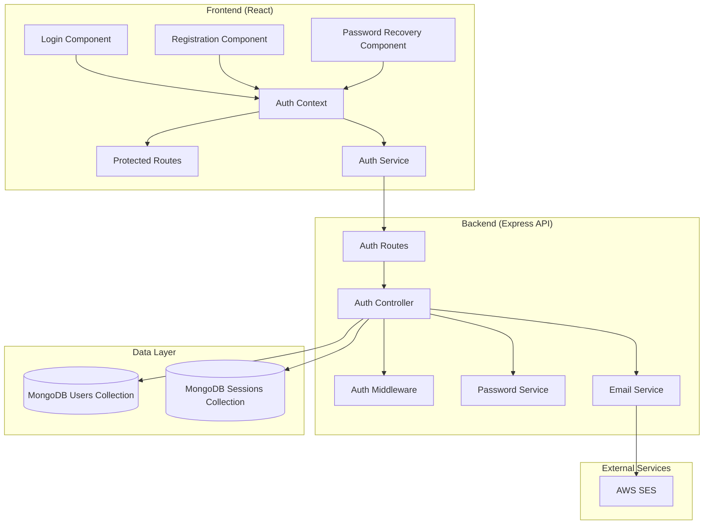

# Design Document: User Authentication System

## Overview

This design document outlines the implementation of a comprehensive user authentication system for the Mozambique Portal application. The system will integrate seamlessly with the existing React/Express/MongoDB stack while leveraging Tabler UI components for consistent styling and AWS SES for reliable email delivery.

The authentication system will provide secure user registration, login, session management, and password recovery functionality. The design emphasizes security best practices, user experience consistency, and maintainable code architecture.

## Architecture

### High-Level Architecture



### Technology Stack Integration

- **Frontend**: React 18.2.0 with existing Tabler UI components
- **Backend**: Express.js API (existing server structure)
- **Database**: MongoDB (existing connection via `mongodb` package)
- **Authentication**: JWT tokens with refresh token rotation
- **Password Hashing**: bcrypt for secure password storage
- **Email Service**: AWS SES for password recovery emails
- **Session Storage**: MongoDB collections for session management

## Components and Interfaces

### Frontend Components

#### 1. Authentication Context (`AuthContext`)
```javascript
interface AuthContextType {
  user: User | null;
  login: (username: string, password: string) => Promise<boolean>;
  logout: () => void;
  register: (userData: RegisterData) => Promise<boolean>;
  requestPasswordReset: (email: string) => Promise<boolean>;
  resetPassword: (token: string, newPassword: string) => Promise<boolean>;
  isAuthenticated: boolean;
  isLoading: boolean;
}
```

#### 2. Login Component (`LoginForm`)
- Tabler-styled form with username/password fields
- Form validation and error display
- Integration with AuthContext for authentication
- Links to registration and password recovery

#### 3. Registration Component (`RegisterForm`)
- User registration form with validation
- Username, email, and password fields
- Password strength requirements
- Terms of service acceptance

#### 4. Password Recovery Components
- `ForgotPasswordForm`: Email input for password reset request
- `ResetPasswordForm`: New password form accessed via email link

#### 5. Protected Route Component (`ProtectedRoute`)
- Route wrapper that checks authentication status
- Redirects unauthenticated users to login
- Handles loading states during auth checks

### Backend API Endpoints

#### Authentication Routes (`/api/auth`)

```javascript
POST /api/auth/login
POST /api/auth/register
POST /api/auth/logout
POST /api/auth/refresh
POST /api/auth/forgot-password
POST /api/auth/reset-password
GET  /api/auth/verify-token
```

#### Auth Controller Methods
- `login()`: Validate credentials and issue JWT tokens
- `register()`: Create new user account with validation
- `logout()`: Invalidate refresh tokens
- `refreshToken()`: Issue new access token using refresh token
- `forgotPassword()`: Generate and send password reset email
- `resetPassword()`: Validate reset token and update password
- `verifyToken()`: Validate JWT token for protected routes

### Middleware Components

#### 1. Authentication Middleware (`authMiddleware`)
- JWT token validation for protected routes
- Token extraction from Authorization header
- User context injection into request object

#### 2. Rate Limiting Middleware
- Prevent brute force attacks on login endpoints
- Configurable limits for different endpoint types
- IP-based and user-based rate limiting

## Data Models

### User Schema (MongoDB Collection: `users`)

```javascript
{
  _id: ObjectId,
  username: String (unique, required),
  email: String (unique, required),
  passwordHash: String (required),
  createdAt: Date (default: now),
  lastLoginAt: Date,
  isActive: Boolean (default: true),
  emailVerified: Boolean (default: false),
  profile: {
    firstName: String,
    lastName: String,
    organization: String
  }
}
```

### Session Schema (MongoDB Collection: `user_sessions`)

```javascript
{
  _id: ObjectId,
  userId: ObjectId (ref: users),
  refreshToken: String (hashed),
  accessToken: String (hashed),
  expiresAt: Date,
  createdAt: Date (default: now),
  ipAddress: String,
  userAgent: String,
  isActive: Boolean (default: true)
}
```

### Password Reset Schema (MongoDB Collection: `password_resets`)

```javascript
{
  _id: ObjectId,
  userId: ObjectId (ref: users),
  resetToken: String (hashed),
  expiresAt: Date,
  createdAt: Date (default: now),
  used: Boolean (default: false),
  ipAddress: String
}
```

### Database Indexes

```javascript
// Users collection
db.users.createIndex({ username: 1 }, { unique: true });
db.users.createIndex({ email: 1 }, { unique: true });

// Sessions collection
db.user_sessions.createIndex({ userId: 1 });
db.user_sessions.createIndex({ expiresAt: 1 }, { expireAfterSeconds: 0 });
db.user_sessions.createIndex({ refreshToken: 1 });

// Password resets collection
db.password_resets.createIndex({ resetToken: 1 });
db.password_resets.createIndex({ expiresAt: 1 }, { expireAfterSeconds: 0 });
```

## Correctness Properties

*A property is a characteristic or behavior that should hold true across all valid executions of a system—essentially, a formal statement about what the system should do. Properties serve as the bridge between human-readable specifications and machine-verifiable correctness guarantees.*

After analyzing the acceptance criteria, I've identified the following correctness properties that can be validated through property-based testing. These properties ensure the authentication system behaves correctly across all possible inputs and scenarios.

### Property Reflection

Before defining the final properties, I reviewed all testable criteria to eliminate redundancy:

- **Authentication Flow Properties**: Combined login success/failure scenarios into comprehensive authentication properties
- **Data Security Properties**: Consolidated password hashing, encryption, and security measures into unified security properties  
- **Session Management Properties**: Merged session creation, maintenance, and cleanup into cohesive session lifecycle properties
- **UI Consistency Properties**: Combined Tabler styling requirements into comprehensive UI integration properties
- **Database Properties**: Consolidated data validation, constraints, and storage requirements into unified data integrity properties

### Core Authentication Properties

**Property 1: Authentication Credential Validation**
*For any* user credentials (username/password combination), the authentication system should either successfully authenticate and create a session for valid credentials, or reject invalid credentials with appropriate error messaging, but never allow unauthorized access.
**Validates: Requirements 1.2, 1.3**

**Property 2: Password Security Round-Trip**
*For any* user password, when stored in the database, it should be hashed using a secure algorithm, and the original plaintext password should never be recoverable from the stored hash, while still allowing successful authentication with the original password.
**Validates: Requirements 2.2**

**Property 3: User Data Uniqueness Enforcement**
*For any* attempt to create users with duplicate usernames or email addresses, the system should reject the creation and maintain database integrity by enforcing unique constraints.
**Validates: Requirements 2.4**

### Session Management Properties

**Property 4: Session Lifecycle Consistency**
*For any* user login session, the system should create a secure token upon successful authentication, maintain the authenticated state during the session lifetime, and properly clean up and invalidate the session upon logout or expiration.
**Validates: Requirements 4.1, 4.2, 4.3**

**Property 5: Session Security Enforcement**
*For any* detected suspicious activity or security violation, the system should immediately invalidate the associated session and prevent further access using that session.
**Validates: Requirements 4.4**

### Password Recovery Properties

**Property 6: Password Reset Token Security**
*For any* password reset request, the system should generate a secure, time-limited token, send it via email, allow password reset only with valid unused tokens, and invalidate tokens after use or expiration.
**Validates: Requirements 3.2, 3.3, 3.4, 7.4**

**Property 7: Password Update Persistence**
*For any* successful password reset or update, the new password hash should be properly stored in the database and immediately usable for authentication, while the old password becomes invalid.
**Validates: Requirements 3.5**

### Data Integrity Properties

**Property 8: User Registration Data Completeness**
*For any* new user registration, all required fields (username, hashed password, email, creation date) should be stored in the database with proper validation and formatting.
**Validates: Requirements 2.1, 8.2**

**Property 9: Input Validation Consistency**
*For any* form submission in the authentication system, all input data should be validated for security, format requirements, and business rules before processing or storage.
**Validates: Requirements 6.1, 8.4**

### Security Properties

**Property 10: Rate Limiting Protection**
*For any* series of authentication attempts from the same source, the system should enforce rate limiting to prevent brute force attacks while allowing legitimate usage patterns.
**Validates: Requirements 6.2**

**Property 11: Data Encryption in Transit and Storage**
*For any* sensitive data (passwords, tokens, session data), the system should use appropriate encryption when storing or transmitting the data, ensuring no sensitive information is exposed in plaintext.
**Validates: Requirements 6.3**

### UI Integration Properties

**Property 12: Tabler Component Consistency**
*For any* authentication-related UI component, the rendered output should use Tabler UI classes, components, and styling patterns consistent with the existing application design.
**Validates: Requirements 5.1, 5.2, 5.3**

### AWS Integration Properties

**Property 13: Email Service Integration**
*For any* password recovery email request, the system should successfully integrate with AWS SES for email delivery, handle delivery failures gracefully, and provide appropriate user feedback.
**Validates: Requirements 7.1, 7.3**

## Error Handling

### Authentication Errors
- **Invalid Credentials**: Clear error messages without revealing whether username or password is incorrect
- **Account Lockout**: Temporary account suspension after repeated failed attempts
- **Session Expiration**: Graceful handling with automatic redirect to login
- **Token Validation Failures**: Proper cleanup and re-authentication prompts

### Database Errors
- **Connection Failures**: Retry logic with exponential backoff
- **Constraint Violations**: User-friendly messages for duplicate usernames/emails
- **Data Validation Errors**: Specific field-level error messages
- **Transaction Failures**: Proper rollback and error reporting

### Email Service Errors
- **AWS SES Failures**: Fallback mechanisms and user notification
- **Rate Limiting**: Queue management for email delivery
- **Invalid Email Addresses**: Validation and error reporting
- **Network Timeouts**: Retry logic and status tracking

### Security Error Handling
- **CSRF Token Validation**: Automatic token refresh and form resubmission
- **Rate Limiting Violations**: Progressive delays and user notification
- **Suspicious Activity Detection**: Automatic session termination and logging
- **Malformed Requests**: Input sanitization and rejection

## Testing Strategy

### Dual Testing Approach

The authentication system will be validated using both unit tests and property-based tests to ensure comprehensive coverage:

**Unit Tests** will focus on:
- Specific authentication scenarios (valid login, invalid password, etc.)
- Edge cases (empty inputs, malformed data, boundary conditions)
- Integration points between components
- Error conditions and exception handling
- UI component rendering with specific props

**Property-Based Tests** will focus on:
- Universal properties that hold across all inputs
- Security properties across randomized attack scenarios
- Data integrity across various user data combinations
- Session management across different usage patterns
- UI consistency across different component states

### Property-Based Testing Configuration

**Testing Framework**: We will use `fast-check` for JavaScript property-based testing, integrated with Jest for the testing environment.

**Test Configuration**:
- Minimum 100 iterations per property test to ensure comprehensive input coverage
- Each property test will be tagged with a comment referencing its design document property
- Tag format: **Feature: user-authentication, Property {number}: {property_text}**

**Test Data Generation**:
- **User Credentials**: Generate valid/invalid username and password combinations
- **Email Addresses**: Generate valid/invalid email formats for testing validation
- **Session Tokens**: Generate various token formats for security testing
- **Form Data**: Generate complete and partial form submissions
- **Security Scenarios**: Generate various attack patterns for security testing

### Integration Testing

**Database Integration**:
- Test MongoDB connection and query operations
- Validate schema constraints and indexes
- Test transaction handling and rollback scenarios

**AWS SES Integration**:
- Test email sending with various recipient scenarios
- Validate error handling for delivery failures
- Test rate limiting and queue management

**Frontend-Backend Integration**:
- Test complete authentication flows end-to-end
- Validate session management across page navigation
- Test error propagation from backend to frontend

### Security Testing

**Authentication Security**:
- Brute force attack simulation
- Session hijacking prevention testing
- CSRF protection validation
- SQL injection and NoSQL injection testing

**Data Security**:
- Password hashing strength validation
- Token security and expiration testing
- Encryption verification for sensitive data
- Input sanitization effectiveness

### Performance Testing

**Load Testing**:
- Concurrent user authentication scenarios
- Database query performance under load
- Session management scalability
- Email service throughput testing

**Stress Testing**:
- System behavior under extreme load
- Memory usage during peak authentication
- Database connection pool management
- Error recovery under stress conditions